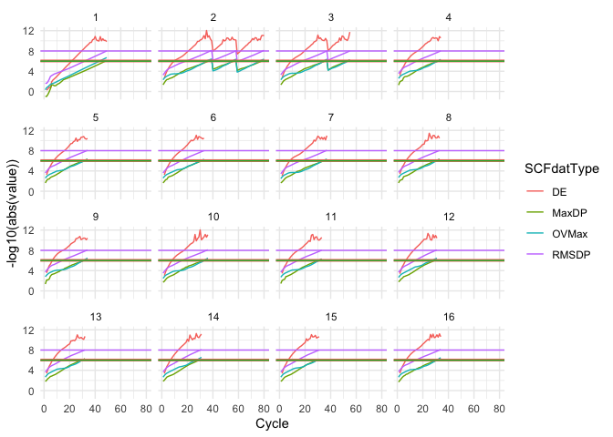
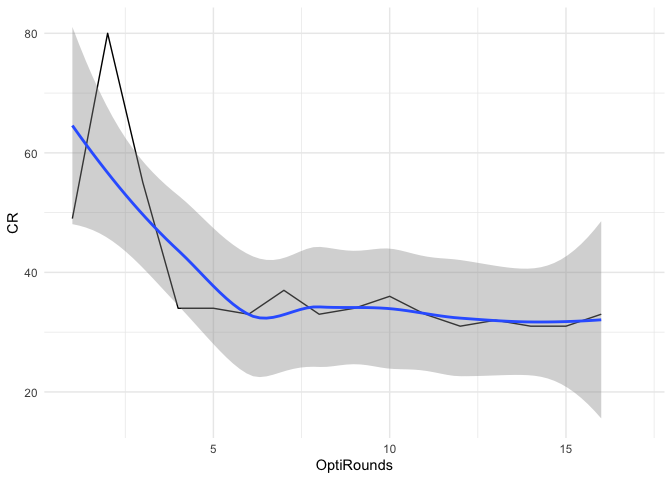
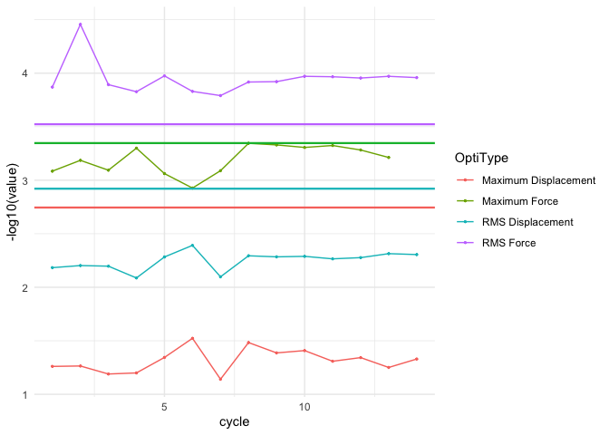

<!-- README.md is generated from README.Rmd. Please edit that file -->

# SCFMonitor

<!-- badges: start -->
<!-- badges: end -->

The goal of SCFMonitor is to enable **Gaussian** the quantum chemistry
calculation software users to easily read the Gaussian .log files and
monitor the SCF convergence and geometry optimization process with
little effort and clear, beautiful and clean outputs. It can generate
graphs using tidyverse to let users check SCF convergence and geometry
optimization process real time. The software supports processing .log
files remotely using with `rbase::url()`. This software is a suitcase
for saving time and energy for the researchers, supporting multiple
versions of Gaussian.

## Installation

You can install the development version of SCFMonitor from
[GitHub](https://github.com/) with:

``` r
# install.packages("devtools")
devtools::install_github("AzuleneG/SCFMonitor")
```

## Example

This is a basic example which shows how to monitor a SCF convergence
process:

``` r
  library(SCFMonitor)
  
  #Generate the plots
  MultipleRoundOptiSCFIntegratedMonitor(SCFMonitorExample())
#> Warning: Removed 1 row containing missing values or values outside the scale range
#> (`geom_line()`).
```



``` r
  OptiSCFConvergenceRoundMonitor(SCFMonitorExample())
#> `geom_smooth()` using method = 'loess' and formula = 'y ~ x'
#> Warning: Removed 1 row containing non-finite outside the scale range (`stat_smooth()`).
#> Removed 1 row containing missing values or values outside the scale range
#> (`geom_line()`).
```



``` r
  OptiConvergenceMonitor(SCFMonitorExample())
```


