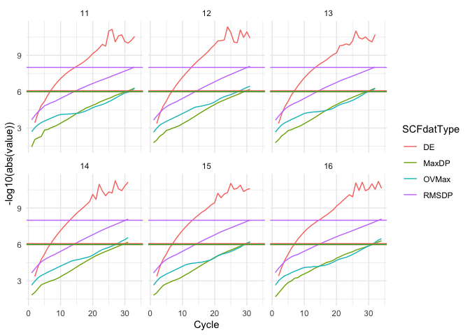

<!-- README.md is generated from README.Rmd. Please edit that file -->

# SCFMonitor

<!-- badges: start -->

[](https://github.com/AzuleneG/SCFMonitor/actions/workflows/R-CMD-check.yaml)
[](https://app.codecov.io/gh/AzuleneG/SCFMonitor?branch=master)
<!-- badges: end -->

The goal of SCFMonitor is to enable **Gaussian** the quantum chemistry
calculation software users to easily read the Gaussian .log files and
monitor the SCF convergence and geometry optimization process with
little effort and clear, beautiful and clean outputs. It can generate
graphs using tidyverse to let users check SCF convergence and geometry
optimization process real time. The software supports processing .log
files remotely using with `rbase::url()`. This software is a suitcase
for saving time and energy for the researchers, supporting multiple
versions of Gaussian.

SCF monitor works for the `.log` files of the jobs that is still under
calculation. `SCFMonitor` reads the convergence standard of SCF and
optimization jobs automatically, adapting keywords like
`SCF=conver=6  IOp(8/117=-99) IOp(7/127=-99)` or `opt=loose`.

## Installation

You can install the development version of SCFMonitor from
[GitHub](https://github.com/) with:

``` r
install.packages("SCFMonitor")
library(SCFMonitor)
```

## Function and Example

**When using with the log files stored on your hard drive, please
replace `SCFMonitorExample()` to the directory of the .log file. For
example, `"~/GaussianJobs/opti/job.log"` or
`"C:\GaussianJobs\opti\job.log"`**

**ADD `#p` in the keyword of `.gjf` files to make sure specific
information of SCF calculation is printed in the `.log` files.**
Otherwise it won’t work properly!

### 1.Monitor the SCF calculations

To check the SCF process of a Gaussian job, use
`MultipleRoundOptiSCFIntegratedMonitor()`. It works both for the jobs
with multiple rounds of SCF calculation and that only include one round
of SCF.

To show the SCF convergence process of a directed `opti` job’s round,
use `SingleRoundOptiSCFIntegratedMonitor()` instead.

``` r
library(SCFMonitor)

MultipleRoundOptiSCFIntegratedMonitor(SCFMonitorExample())
#> Warning: Removed 1 row containing missing values or values outside the scale range
#> (`geom_line()`).
```


``` r
#showing the information of all the rounds

MultipleRoundOptiSCFIntegratedMonitor(SCFMonitorExample(), 6)
#> Warning: Removed 1 row containing missing values or values outside the scale range
#> (`geom_line()`).
```



``` r
#showing the information of top six rounds


SingleRoundOptiSCFIntegratedMonitor(SCFMonitorExample(), 5)
#> Warning: Removed 1 row containing missing values or values outside the scale range
#> (`geom_line()`).
```


``` r
#show the fifth optimization cycle's SCF convergence process
```

### 2.Monitor the rounds of SCF Gaussian undergoes to meet the convergence standard.

``` r
OptiSCFConvergenceRoundMonitor(SCFMonitorExample())
#> `geom_smooth()` using method = 'loess' and formula = 'y ~ x'
#> Warning: Removed 1 row containing non-finite outside the scale range
#> (`stat_smooth()`).
#> Warning: Removed 1 row containing missing values or values outside the scale range
#> (`geom_line()`).
```


### 3.Check the optimization process of a Gaussian `opt` job.

``` r
OptiConvergenceMonitor(SCFMonitorExample())
```

 If the
`.log` file is on sever and available through `https`, use `url()` to
implement `SCFMonitor` like doing so on the files in the drive.

``` r
MultipleRoundOptiSCFIntegratedMonitor(url("somwhere.com/someguy/calculations/xxx.log"))
```
